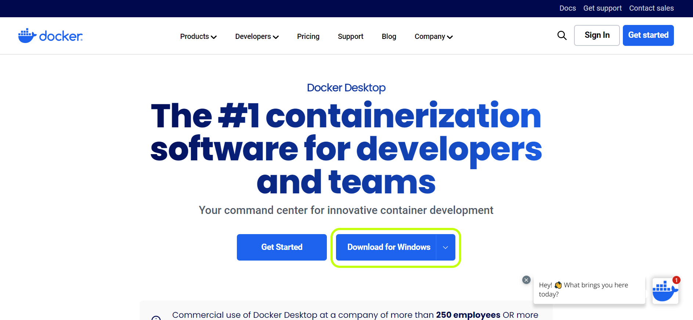
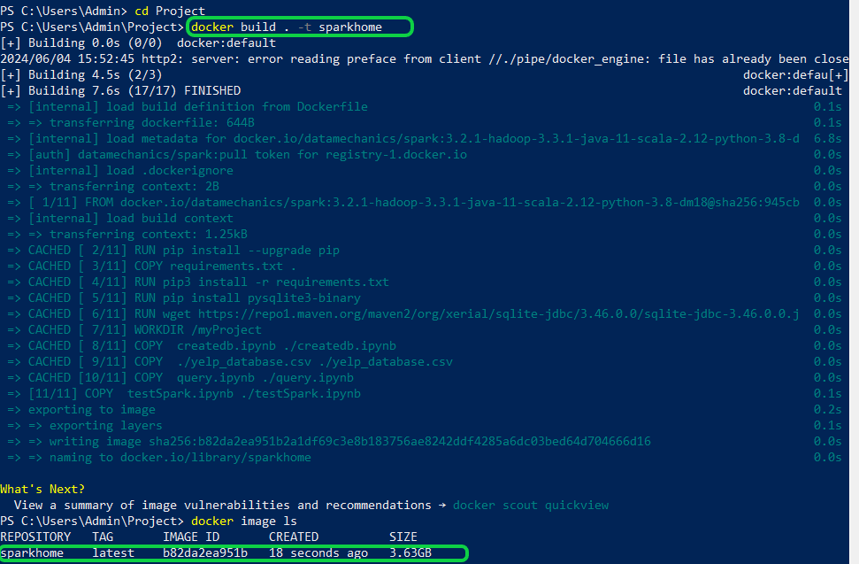
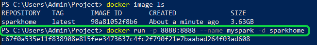
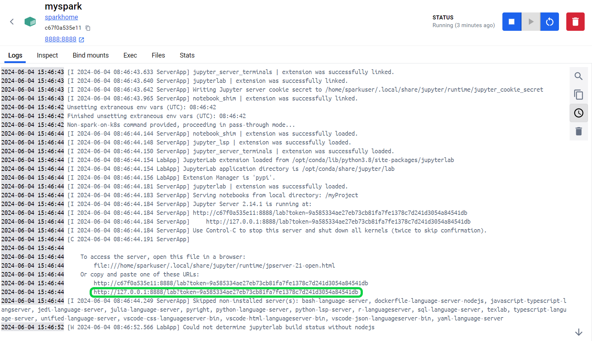
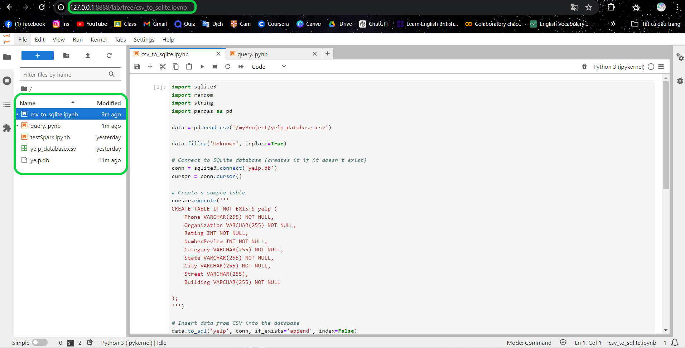
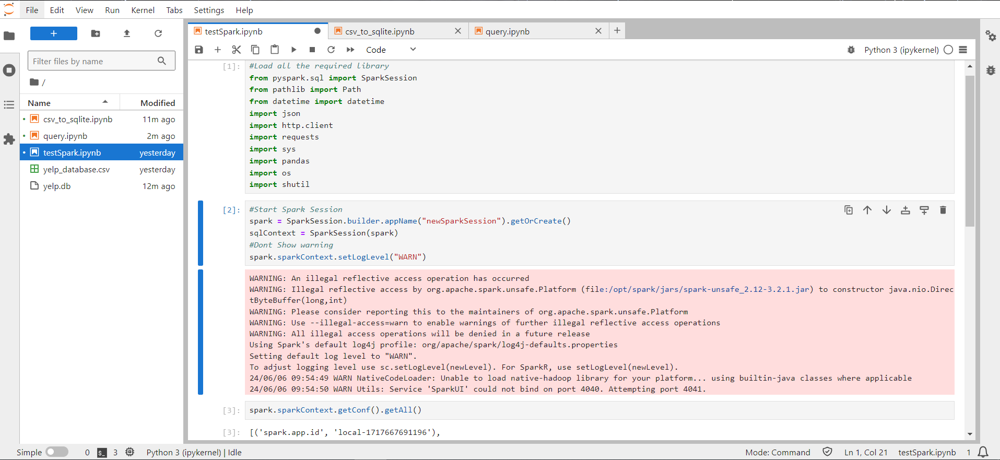
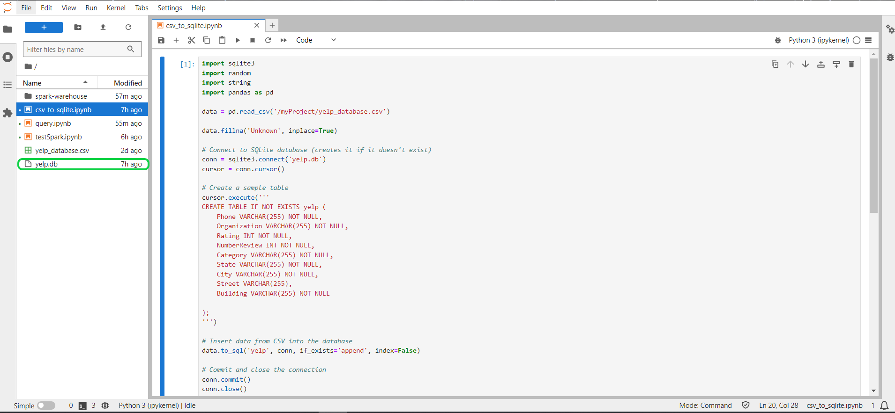

# Docker Project
## Description
Dự án này nhằm mục đích thiết lập và chạy SparkSQL trong Docker container. Các phần phụ thuộc cần thiết trong container được cài đặt để thực hiện các truy vấn SQL trên cơ sở dữ liệu (SQLite) cũng được lưu trữ trong cùng một container.
## Prerequisites
Trước khi triển khai dự án, hãy đảm bảo máy tính của bạn có đủ bộ nhớ và đã cài đặt Docker (chạy hiệu quả với RAM 16GB). 
**Docker Desktop** có giao diện dễ sử dụng là một lựa chọn tốt khi muốn làm quen với Docker. Nó cung cấp mọi thứ bạn cần để xây dựng và chạy các container Docker trên máy tính cá nhân một cách dễ dàng và hiệu quả.

Tải Docker Desktop tại [Docker Desktop](https://www.docker.com/products/docker-desktop/) và chọn phiên bản phù hợp với hệ điều hành của máy. 


## Installation Spark in Docker
**Bước 1: Xây dựng Docker Image:**

```c
docker build . -t sparkhome 
```
Câu lệnh khởi tạo một docker image có tên là `sparkhome` từ `Dockerfile`.



**Bước 2: Khởi tạo docker container**
```c
docker run -p 8888:8888 --name myspark -d sparkhome
```
Câu lệnh này sẽ khởi động một container Docker từ image `sparkhome`, mở cổng `8888` cho phép truy cập từ bên ngoài, đặt tên cho container là `myspark`, và chạy container ở chế độ nền.



**Bước 3: Run docker container**
Tại option `Container` của Docker Desktop sẽ xuất hiện một container có tên là `myspark`


Trong `logs` sẽ có liên kết đến Jupyter lab



**Bước 4:**
- Sao chép và dán vào trình duyệt để chạy phiên pyspark từ trình duyệt.




- Tại Jupyter lab chạy file `testSpark.ipynb` để kiểm tra Spark có hoạt động từ Jupyter Notebook không.


## SparkSQL

**Bước 1: Tạo cơ sở dữ liệu**
- Chạy file `csv-to-sqlite.ipynb` với mục đích tạo ra một cơ sở dữ liệu SQLite bằng sqlite3 và chèn dữ liệu từ một file .csv vào cơ sở dữ liệu đó. Từ đó có thể dễ dàng thực hiện các thao tác truy vấn và phân tích dữ liệu sau này.


**Bước 2: Kết nối với database và thực hiện truy vấn**
- Chạy file `query.ipynb`

**Giải thích code**
- Kết nối với database: 
```c
from pyspark.sql import SparkSession
spark = SparkSession.builder \
    .appName("mySQLite") \
    .config("spark.jars", "/path/to/sqlite-jdbc-3.34.0.jar") \
    .getOrCreate()
```
```c
jdbc_url = "jdbc:sqlite:/myProject/yelp.db"  # URL JDBC cho cơ sở dữ liệu SQLite
connection_properties = {
    "driver": "org.sqlite.JDBC"  # Chỉ định lớp driver cho SQLite
}

df = spark.read.jdbc(url=jdbc_url, table="yelp", properties=connection_properties)
```
*Để kết nối với database SQLite, dự án sử dụng một chuẩn API để tương tác với cơ sở dữ liệu có tên là JDBC driver. Cụ thể là JDBC driver 3.34.0.*

- Thực hiện truy vấn và so sánh thời gian chạy các câu lệnh truy vấn: 
*Xem thêm tại `query.ipynb`*

## Conclusion
Tóm lại, project hướng dẫn đầy đủ về việc cài đặt và sử dụng SparkSQL trong một Docker container, thực hiện được những thao tác CRUD cơ bản và so sánh thời gian thực hiện các câu truy vấn.

## Contact Information

_Thủy Phạm
Email: phamthuthuy_t66@hus.edu.vn_ 


